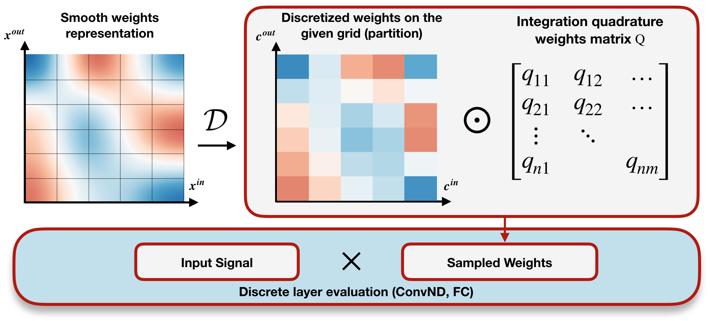

# TorchIntegral

## Table of contents
- [TorchIntegral](#torchintegral)
- [Requirements](#requirements)
- [Installation](#installation)
- [Usage examples](#usage-examples)
- [Frequently asked questions](#frequently-asked-questions)
- [TODO](#todo)
- [Further research](#further-research)
- [References](#references)

This library is official implementation of ["Integral Neural Networks"][paper_link] paper in Pytorch.



## Requirements
- pytorch 2.0+
- torchvision
- numpy
- scipy
- Cython
- catalyst
- pytorchcv

## Installation

Latest stable version:
```
pip install torchintegral
```
Latest on GitHub:
```
pip install git+https://github.com/TheStageAI/TorchIntegral.git
```

## Usage examples
### Convert your model to integral model:
```python
import torch
import torch_integral as inn

class MnistNet(torch.nn.Module):
    def __init__(self):
        super().__init__()
        self.conv_1 = nn.Conv2d(1, 16, 3, padding=1)
        self.conv_2 = nn.Conv2d(16, 32, 5, padding=2)
        self.conv_3 = nn.Conv2d(32, 64, 5, padding=2)
        self.relu = nn.ReLU()
        self.pool = nn.AvgPool2d(2, 2)
        self.linear = nn.Linear(64, 10)

    def forward(self, x):
        x = self.relu(self.conv_1(x))
        x = self.pool(x)
        x = self.relu(self.conv_2(x))
        x = self.pool(x)
        x = self.relu(self.conv_3(x))
        x = self.pool(x)
        x = self.linear(x[:, :, 0, 0])
        return x


model = MnistNet()
wrapper = inn.IntegralWrapper(init_from_discrete=True)
continuous_dims = {'conv_1.weight': [0], 'conv_2.weight': [0]}
inn_model = wrapper(model, example_input=(1, 3, 28, 28))
```
Set distribution for random number of integration points:
```python
inn_model.groups[0].reset_distribution(inn.UniformDistribution(8, 16))
inn_model.groups[1].reset_distribution(inn.UniformDistribution(16, 48))
```
Train integral model using vanilla training methods. 
Ones the model is trained resample (prune) it to arbitrary size:
```python
inn_model.groups[0].resize(12)
inn_model.groups[1].resize(16)
```
After resampling of the integral model it can be evaluated as usual discrete model:
```python
discrete_model = inn_model.tranform_to_discrete()
```

### One can use [`torch_integral.graph`](./torch_integral/graph/) to build dependecy graph for structured pruning:
```python
from torch_integral import IntegralTracer

groups = IntegralTracer(model, example_input=(3, 28, 28)).build_groups()
pruner = L1Pruner()

for group in groups:
    pruner(group, 0.5)
```

### Integrating a function using numerical quadratures:
```python
from torch_integral.quadrature import RiemannQuadrature, integrate

def function(grid):
    return torch.sin(10 * grid[0])

quadrature = RiemannQuadrature(integration_dims=[0])
grid = [torch.linspace(0, 3.1415, 100)]
integrate(quadrature, function, grid)
```

More examples can be found in [`examples`](./examples) directory.

## Frequently asked questions
See [FAQ](FAQ.md) for frequently asked questions.

## TODO
- Add models zoo.
- Fix tracing of reshape and view operations.
- Add integral self attention and batch norm layers.
- Fix serialization of parametrized model.

## Further research
Here is some ideas for community to continue this research:
- Weight function parametrization with [SiReN](https://arxiv.org/pdf/2006.09661.pdf).
- Combine INNs and [neural ODE](https://arxiv.org/pdf/1806.07366.pdf).
- For more flexible weight tensor parametrization let the function have breakpoints.
- Multiple TSP for total variation minimization task.
- Due to lower total variation of INNs it's interesting to check resistance of such models to adversarial attacks.
- Train integral GANs.
- Research different numerical quadratures, for example Monte-Carlo integration or Bayesian quadrature.

## References
If this work was useful for you, please cite it with:
```
@InProceedings{Solodskikh_2023_CVPR,
    author    = {Solodskikh, Kirill and Kurbanov, Azim and Aydarkhanov, Ruslan and Zhelavskaya, Irina and Parfenov, Yury and Song, Dehua and Lefkimmiatis, Stamatios},
    title     = {Integral Neural Networks},
    booktitle = {Proceedings of the IEEE/CVF Conference on Computer Vision and Pattern Recognition (CVPR)},
    month     = {June},
    year      = {2023},
    pages     = {16113-16122}
}
```
and
```
@misc{TorchIntegral,
	author={Kurbanov A., Solodskikh K.},
	title={TorchIntegral},
	year={2023},
	url={https://github.com/TheStageAI/TorchIntegral},
}
```

[paper_link]: https://openaccess.thecvf.com/content/CVPR2023/papers/Solodskikh_Integral_Neural_Networks_CVPR_2023_paper.pdf